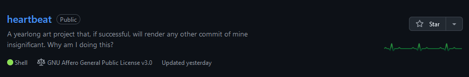

# Questions nobody has asked me:

## What is this?
Well, I decided to see if the GitHub repo activity monitor can be easily affected by a script to upload commits on a daily basis. My intention is to create something that resembles an ECG reading over the course of a year through automatic commits using a shell script.

## Why is this?
Tell you what you wanna know; So what's a little [Vertigo](https://youtu.be/soNC1LS0vnI)?

## How can I is this?
Given that I haven't done it myself yet...well...don't expect results until you see them on this repo. I have chmodded heartbeat.sh and created the following cron job:
`0 0 * * * /path/to/github-heartbeat/heartbeat.sh` on a VPS. And now I wait.
